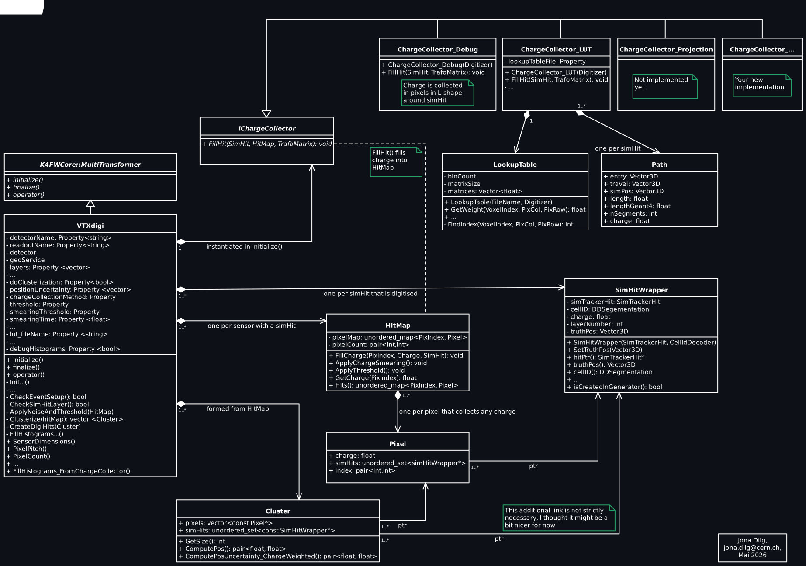

# VTXdidi_Modular: Silicon pixel digitizer
Developed by Jona Dilg (jona.dilg@cern.ch), Armin Ilg. 2026.

## Description
The vertex digitizer creates digiHits from simHits by `TrackerHitPlane` by simulating the deposition and subsequent collection of charges in the sensor. The exact implementation of charge collection is user-definable.

### Output
Produces EDM4hep `TrackerHitPlane` hits (referred to as digiHits), either per pixel hit or per cluster. For each `TrackerHitPlane`, creates a `TrackerHitSimTrackerHitLink` to each `SimTrackerHit` that contributed charge to any involved pixel. 

### Charge Collector Implementations
The algorithm allows a choice of different charge collectors, defined by the `ChargeCollectionMethod` Gaudi property. 

Each charge collector implements a method to distribute a simHit's deposited charge to the pixels around that simHit.

#### `SinglePixel`
Simply fills the total charge deposited by a simHit into the pixel that the simHit position lies in. This will always produce a cluster size of 1 pix/clst and the binary sensor resolution expectation of pitch/sqrt(12) (at vertical incidence angles).

#### `Debug`
Takes the pixel that the simHit position lies in as the central pixel. Deposited charge is distributed to pixels in an L-shape:
- 50% charge to the central pixel (index `[i_u,i_v]`)
- 30% charge to the pixel to the right of the central pixel (index `[i_u+1,i_v]`)
- 10% charge each to the two pixels above the central pixel (indices `[i_u,i_v+1]` and `[i_u,i_v+2]`)
This is intended to be used to test the correct `u`/`v` orientation of the pixel

#### `LookupTable`
Shares charge among a hits surrounding pixels according to a lookup table. These lookup tables are generated from detailed simulations performed in sensor R&D. 

**Requires** Gaudi property `LookupTableFile`.

A validation of this algorithm on test beam data is in progress.

An exemplary, Gaussian based LUT is placed in the examples folder.

Further information:
- This talk in the DRD3 WG4 (Simulation) Meeting contains more information on the implementation and preliminary results: https://indico.cern.ch/event/1658032/contributions/6968509/attachments/3239139/5776904/2026-03-16_DRD3-WG4.pdf
- An older version was also held in the FCC Full Sim Working Meeting: https://indico.cern.ch/event/1613709/contributions/6814309/attachments/3190168/5677333/2025-12-10_FCC-FullSym-WorkingMeeting-3.pdf


## Gaudi Properties
- `SubDetectorName` - Name of the subdetector (eg. `Vertex`)
- `SubDetectorChildName` - Name of the subdetector child (eg. `VertexBarrel`), if applicable. If undefined, the subdetector itself is assumed to contain layers as children.
- `Clusterize` - Enable clustering of pixel hits. Defaults to `True`
    - `True` - Clusterize pixel hits. Creates an EDM4hep `TrackerHitPlane` for each cluster. The hit position is the center of gravity of the cluster. The timestamp is the earliest timestamp among simHits that contributed to this cluster (possibly smeared by a gaussian according to `TimeSmearing`).
    - `False` - Generate an EDM4hep `TrackerHitPlane` for each pixel hit, without clustering. The hit position is the pixel center. The timestamp is the earliest timestamp among the contributing simHits (possibly smeared).
- `ChargeCollectionMethod` - Select the charge collection implementation. Defaults to `SinglePixel` (for now)
- `Layers` - Select which layers of the (sub)detector to be digitized (eg. `[0, 1, 2]`). Defaults to digitizing all layers of the subdetector.
- `Threshold` - Sets a pixel threshold. After charges in an event have been collected in pixels, all pixels with `collected charges < threshold` are ignored. In terms of e-. Defaults to 0.
- `ChargeSmearing` - Sets the sigma of the Gaussian smearing that is applied to each pixels collected charge. In terms of e-. Defaults to 0, where no smearing is applied. Note that Pixels that do not collect any charge in an event are not smeared (eg. this can not be used to generate random pixel noise, only to smear the resolution on charge that is actually being collected), for performance.
- `TimeSmearing` - Sets the sigma of the Gaussian smearing that is applied to each pixel hit's timestamp before clustering / creating per-pixel digiHits. **UNIT???**. Defaults to 0.
- `ClusterPositionUncertainty` - Each digiHit has an estimate of it's spatial resolution uncertainty. To first order, this is simply the sensors spatial resolution in `u` and `v`. Yet, the spatial resolution changes with cluster shape and charge spread across the cluster (and with particle angle). Estimating a digiHits spatial resolution is important for the tracking algorithm, where a good estimation of the spatial resolution of each cluster allows for more precise refitting. Three different methods for estimating the spatial resolution are implemented:
    - Setting `[sigma_u, sigma_v]` simply applies the same spatial resolution to every digiHit. This is the most basic option.
    - Setting `[sigma_u1, sigma_u2, sigma_u3, sigma_v1, sigma_v2, sigma_v3]` applies different residuals based on the cluster lengths in `u` and `v`. Clusters with a length above 3 will be assigned the `sigma_i3` as well. 
    - Setting `[]` does a basic charge-weighted uncertainty estimation, acting as an upper limit on the spatial resolution. The charge-weighted uncertainty estimation is based on the assumption that single-pixel clusters have a resolution of pitch/sqrt(12), while larger clusters improve the resolution. This is, in turn, based on the assumption that the hit-distribution inside single-pixel clusters is completely flat, which does not hold for sensors with any significant charge sharing (such as small-pitch TPSCo 65nm CIS). With strong charge sharing, only hits close to the center of a pixel produce single-pixel clusters, while pixels closer to the edge produce multi-pixel clusters. This biases the resolution of single-pixel clusters, improving it. Because of the assumption, this method calculates an upper limit on a clusters spatial resolution. Importantly, this upper limit does not necessarily represent the dependence on the cluster size well, and can introduce a bias with better spatial resolution in multi-pixel clusters that might be unphysical.
- `DebugHistograms` - Set to `True` to enable producing debugging histograms with the `Gaudi__Histograming__Sink__Root` service. Can decrease performance significantly, but is useful for debugging. Defaults to `False`. Include the following in the options file to produce the histograms file: 
    ```
    from Configurables import Gaudi__Histograming__Sink__Root as RootHistoSink
    rootHistSvc = RootHistoSink("RootHistoSink")
    rootHistSvc.FileName = "OutputFile.root"
    # add rootHistSvc to the ExtSvc ;ist in ApplicationMgr
    ```
- `InfoPrintInterval` - Set the interval at which the event number is printed to the `INFO` debug level at the start of the event. In terms of events. Defaults to 100.
- `LookupTableFile` - Lookup table file, necessary for the `LookupTable` charge collector.
- `LookupTableSegmentStepLength` - In the `LookupTable` charge collector implementation, a particles path through the sensor is sampled in smalls steps, sharing charges among surrounding pixels for each step. This sets that step length. Should be smaller than the LUT binning. In mm. Defaults to 0.0005 mm.
- `DepletedRegionDepthCenter` - Depth of the depleted region center for charge collection (in mm), wrt to the pixel center at 0 mm. Used for plotting of the residuals, does not affect the charge collection & output collection. Necessary for realistic residual distributions for sensors that are not fully depleted: For particles traversing the sensor at a shallow angle, there is a systematic horizontal offset between (a) the simHit position, which is typically at the vertical center of the sensor and (b) the cluster center of gravity that is simulated around where charges are deposited. This offset is corrected for by shifting the truth position along the particle path to the given `DepletedRegionDepthCenter` (but not further than the path's ends). Sensors are typically centered around `w=0`, with `w` in `[-thickness/2 , thickness,2]` (check in the detector model). In mm. Defaults to 0.


---
## Maintainers notes
- **Reference frames**
    - The global detector reference frame uses `x,y,z`, `z` points along the beams and `y` points upwards
    - The local sensor frame is `u,v,w` where `u,v` span the sensor plane and `w` is the sensors normal vector. For barrel sensors, `v` is typically parallel to `z`
- **Vectors** can be given as 
    1) `dd4hep::rec::Vector3D` - fully featured vector, overloads operators `*+-` etc
    2) `edm4hep::Vector3d` - natively used by edm4hep (where simHit, digiHit are from)
    -> generally use `dd4hep::rec::Vector3D`, convert via `ConvertVector()` where `edm4hep::Vector3d` is needed
- **Hit naming** scheme
    - `simTrackerHit` refers to a `edm4hep::SimTrackerHit`
    - `simHit` is always a `VTXdigi_tools::SimHitWrapper` (which contains a edm4hep::SimTrackerHit and some pre-computed info like surface and layer number)
    - `digiHit` refers to `edm4hep::TrackerHitPlane` (the output of this digitizer)
- There are some crude tool tests for the functions in `VTXdigi_tools`. These are not exhaustive, and were only used early on in refactoring the code. Can be executed by calling `VTXdigi_tools::ToolTest()` in `VTXdigi_Modular::initialize()`. Not recommended.
### Units
- All **lengths** are in mm (edm4hep already does this)
    BUT: dd4hep uses cm internally, so convert when passing values to/from dd4hep via `dd4hep::mm = 0.1`
    Conversion: [A] = cm, [B] = mm
    - `A = dd4hep::mm * B`
    - `B = 1/dd4hep::mm * A`
- `Energies` are given in keV, but deposited charge is always handled in terms of electron-hole pairs (3.65 eV per eh-pair). This is much more common in sensor R&D. 

### Preliminary UML diagram


### ToDo list
The code has a number of `TODO:` and `FIXME:` marked. Larger items are:
- *(priority)* **Title** -- Description
- *(medium)* **Hit position uncertainty estimation** -- So far, a clusters spatial resolution estimation is done either via the cluster length in *u* and *v*, or via basic charge-weighted uncertainty estimation. Both of these options are sub-optimal and produce results much worse than what is possible. Optimally, all cluster shape and charge sharing information would be taken into account in calculating a clusters position and position resolution. An ML model trained on truth information might be the easiest way to go, here. Alternatively, an eta-function based approach can be used to correct the hit position beyond simple center-of-gravity by applying an empirically-determined function that accounts for non-linear charge sharing effects. The numeric eta function can be determined from the LUT by projecting it onto the *uv*-plane and measuring the charge-sharing ratio between the central and neighboring pixels. With this, the charge-weighted uncertainty estimation can be improved to account for charge sharing even in single-pixel clusters. *(Talk to reconstruction experts about how this is and might be done for a better understanding of what the digitiser should do)*
- *(medium)* **Transfer propagation-based digitiser** -- Transfer the propagation-based digitizer currently implemented in `VTXDigi_Detailed` to a `ChargeCollector` implementation. Making this possible is the reason this specific architecture was chosen. Not urgent, but will make maintaining the repo a bit simpler.
- *(medium)* **Include some LUTs** -- We hope to include some LUTs for the Standard, n-Blanket and n-Gap layout of the TPSCo 65nm CIS chips in the repo. This is likely not a problem with NDAs, but has to be checked back with seniors.
- *(low)* **N-bit charge information** -- Currently charge information is completely analogue (collected charge per pixel is stored as float). Enable purely digital (N=1) or semi-digital (N>1) readout where the charge information is stored in N bits. This is much closer to how charge information is handled in real systems.
- *(low)* **Timing information in LUT** -- Currently, LUTs do not store any information on the signal shape charges in a given voxel will produce on the electrodes. Timestamps are simply taken from the simHits and smeared. Yet, charges from different voxels can take drastically different times (TPSCo 65nm CIS: O(ns)) to collect. Thus, the timestamps and amplitude of pixel hits might be changed. To simulate this, each LUT entry would need to encode not only the amount of shared charge, but also a parametrisation of the pixel response function. This is computationally expensive, and not implemented in Allpix Squared either. An exact algorithm on how to implement this time encoding is not yet clear.
- *(low)* **Gaussian-smearing based digitizer** -- Implementing such an algorithm here would simplify repository. Because the charge collector acts on pixels (and not on positions like the Gaussian-smearing), this is non-trivial and would require a check in the beginning of the event loop.
- 
