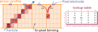
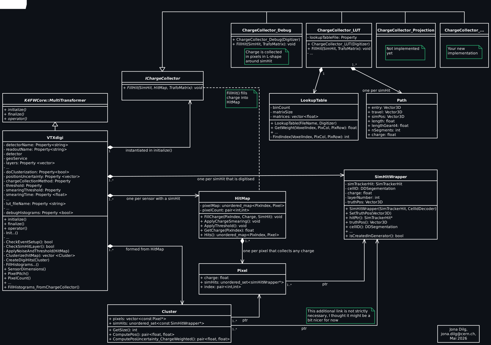

# VTXdigi_Modular: Silicon pixel digitizer
*Developed by Jona Dilg (jona.dilg@cern.ch), Armin Ilg. 2026.*

Vertex detector digitizers model the response of sensors in the vertex detector. In this implementation, this is done by modelling the firing of pixels in response to simulated hits (simHits) to achieve a realistic representation of the sensor's behavior.

The exact modelling method is user-definable. For now the only realistic method is based on **charge collection maps** (CCMaps) generated from detailed simulations of the sensor. The hits generated by this method have been verified extensively against simulations performed in Allpix Squared (typically used in sensor R&D). This method allows for studying realistic sensor designs in the full simulation.

### Some user notes

- The digitizer has the option to cluster the pixel hits and reconstruct cluster positions. This is expected to be superseded by a stand-alone clustering algorithm in the future.
- The algorithm produces accurate cluster sizes for MIPs, but slightly overestimates the cluster size at lower momenta.
- The local z-position of digiHits (wrt. the sensor center) is set to the charge collection depth of the sensor, computed in the charge collector. Otherwise, sensors where most charge is collected from close to the surface (eg. MAPS in TPSCo 65nm CIS) would introduce a strong bias for shallow tracks.
  - For compatibility, the local digiHit z-position can be forced to the sensor's center plane (w = 0) by using `ForceClusterPositionToSensitiveSurface = True`, but this drastically decreases the accuracy of cluster positions for shallow tracks. As of now, conformal tracking requires all digiHits to lie on the sensitive surface of the sensor (ie. local z = 0), otherwise reconstruction performance suffers massively. This dependency will hopefully be removed in the future.

### Content

- List of a all [Gaudi properties](#gaudi-properties)
- [Digitisation steering](#digitisation-steering) - starting point for a digitization steering file
- [Simulation setup in ddsim](#simulation-setup-in-ddsim) - instructions for setting up the simulation to achieve realistic results
- [Algorithm step-by-step](#algorithm-step-by-step) - detailed description of the relevant steps
- [In-depth physics description](#in-depth-physics-description) - discussing charge deposition and the available charge collector implementations
- [Maintainers notes](#maintainers-notes) - notes on conventions in the code and future steps
- [η corrections](#η-correction-explanation) - An eta correction algorithm was implemented, but postponed for now.

## Gaudi properties
**Collections**

- `SimTrackHitCollectionName` - Input `SimTrackerHit` collection (eg. `["VertexBarrelCollection"]`).
  - Must be identical to the name of the DD4hep readout
- `HeaderName` - Input `EventHeader` collection (eg. `["EventHeader"]`). Used to seed the random number generator per event, together with the `UniqueIDGenSvc` (which must be named `uidSvc`).
- `TrackerHitCollectionName` - Output digiHit collection (EDM4hep `TrackerHitPlane`).
- `SimTrkHitRelationsCollection` - Output link collection (EDM4hep `TrackerHitSimTrackerHitLink`).

**Geometry**

- `SubDetectorName` - Name of the subdetector (eg. `Vertex`). Required.
- `SubDetectorChildName` - Name of the subdetector child (eg. `VertexBarrel`), if applicable. If undefined, the subdetector itself is assumed to contain layers as children.
- `Layers` - Select which layers of the (sub)detector to be digitized (eg. `[0, 1, 2]`). Defaults to digitizing all layers of the subdetector. All selected layers must use the same sensor type (pitch, size and thickness). Use separate instances of the algorithm otherwise.
- `GeoSvcName` - Name of the GeoSvc instance. Defaults to `GeoSvc`.
- `EncodingStringParameterName` - Name of the DD4hep constant that contains the cellID encoding string for tracking detectors. Defaults to `GlobalTrackerReadoutID`.

**Charge collection**

- `ChargeCollectionMethod` - Select the charge collection implementation: `ChargeCollectionMap` (default, requires `ChargeCollectionMap` file), `SinglePixel` or `Debug`. See [Charge Collector Implementations](#charge-collector-implementations).
- `ChargeSmearing` - Sets the sigma of the Gaussian smearing that is applied to each pixel's collected charge to model electronic noise. In terms of e-. Pixels that do not collect any charge in an event are not smeared (computing cost would be immense). Defaults to 0 (no smearing).
- `Threshold` - Sets the pixel threshold in terms of number of deposited charges (eh-pairs). Any pixel with charge collected below the threshold (after charge and threshold smearing) are dropped. Defaults to 0.
- `ThresholdDispersion` - Sets the sigma of the Gaussian smearing that is applied to each pixel's threshold, sampled per pixel per event. In terms of e-. Defaults to 0 (no dispersion).
- `TimeSmearing` - Sets the sigma of the Gaussian smearing that is applied to each digiHit's timestamp. In ns. Defaults to 0 (no smearing).

**Path & charge deposition**

(used by charge collectors that model the particle path through the sensor, currently `ChargeCollectionMap`)

- `MeanDepositionsPerUm` - Mean number of discrete charge depositions per um of path length in the sensor. Defaults to 2.65, optimised to match the Allpix Squared simulation.
- `ShiftTruthPosition` - Internally shift the simHit truth position along its path to the charge-collection depth of the charge collector. If set to `False`, angled particle trajectories will bias the residual plots for charge collection maps with asymmetric charge collection across the sensor thickness (eg. TPSCo 65nm CIS). Defaults to `False`.
  - **Only affects the debug histograms (residuals)**, collections remain unchanged.

**Charge collection map** (only used with `ChargeCollectionMethod = "ChargeCollectionMap"`)
- `ChargeCollectionMap` - Charge collection map file (format of Allpix Squared's [[PropagationMapWriter]](https://gitlab.cern.ch/allpix-squared/allpix-squared/-/tree/master/src/modules/PropagationMapWriter)). Required for the `ChargeCollectionMap` charge collector.
- `ChargeCollectionMap_IgnorePitch` - Ignore the sensor thickness and pixel pitch values stored in the charge collection map file. Useful for slightly stretching/shrinking the map to fit curved sensors where the sensor length is not an integer multiple of the pixel pitch. Defaults to `False`, where an error is thrown if the values from the detector geometry do not match the map file. If set to `True`, only a warning is printed in case of a mismatch.

**Clustering & digiHit creation**

- `Clusterize` - Enable clustering of pixel hits. Defaults to `True`.
  - `True` - Pixel hits are clusterized. Creates one EDM4hep `TrackerHitPlane` per cluster.
  - `False` - Create an EDM4hep `TrackerHitPlane` for each pixel hit, without clustering.
- `ClusterizeEndPixelsOnly` - If `True`, only the end pixels of clusters longer than 2 pixels are used to compute the cluster position. This reduces the uncertainty due to deposition fluctuations along the shallow path. Only used if `Clusterize` is `True`. Defaults to `False`.
- `ForceClusterPositionToSensitiveSurface` - If `True`, the cluster position is forced onto the sensitive surface of the sensor (`w = 0`) rather than using the depth from where charges are really being collected. Enabling this might be needed for compatibility, but drastically decreases the accuracy of cluster positions for shallow tracks. Defaults to `False`.
- `ClusterPositionUncertainty` - Each digiHit has an estimate of its spatial resolution uncertainty (`du`, `dv`, in mm). The simplest approximation is the sensor's spatial resolution in `u` and `v`. The spatial resolution changes drastically with incidence angle (ie. cluster length) and charge spread across the cluster. Tracking algorithms rely on good per-hit uncertainty estimates to weight the contribution of each hit in the fit. Three options are implemented (defaults to `[]`):
    - Setting `[]` assigns `pitch/sqrt(12)` in `u` and `v` to every digiHit (the binary resolution). Bad for tracking.
    - Setting `[sigma_u, sigma_v]` simply applies the same spatial resolution to every digiHit. Just as bad for tracking.
    - Setting `[sigma_u1, sigma_u2, sigma_u3, sigma_u4, sigma_u5, sigma_v1, sigma_v2, sigma_v3, sigma_v4, sigma_v5]` (10 values) applies different uncertainties based on the cluster lengths in `u` and `v`, respectively. Clusters with a length of 5 or more are assigned `sigma_i5`. As of now, this is the most realistic estimate. This is only a good assumption if the particle incidence angle is close to vertical, as the cluster length is strongly dependent on the incidence angle. **Needs to be tested for shallow angles.** The values can be extracted from the debug histograms with `test/tools/extract_cluster_uncertainties.py`.

**Monitoring**

- `DebugHistograms` - Set to `True` to enable producing debugging histograms with the `Gaudi__Histograming__Sink__Root` service. Decreases performance significantly. Not recommended for multithreading. Defaults to `False`. Include the following in the options file to produce the histograms file:
    ```
    from Configurables import Gaudi__Histograming__Sink__Root as RootHistoSink
    rootHistSvc = RootHistoSink("RootHistoSink")
    rootHistSvc.FileName = "OutputFile.root"
    # add rootHistSvc to the ExtSvc list in ApplicationMgr
    ```
- `InfoPrintInterval` - Set the interval at which the run and event number are printed at `INFO` level at the start of an event. In terms of events. Defaults to 100.

## Digitisation steering
This is an example of a steering file to start from. It was confirmed to work with the digitisation steering [run_digi_reco.py](https://github.com/HEP-FCC/FCC-config/blob/main/FCCee/FullSim/IDEA/IDEA_o1_v03/run_digi_reco.py) for `IDEA_o1v03`.

The digitiser also needs a `UniqueIDGenSvc` named `uidSvc`, and to write debug histograms a `Gaudi__Histograming__Sink__Root`.

Note that in IDEA o1v03, the inner 3 VTX layers `[0,1,2]` have ARCADIA 20um pitch sensors, while the outer 2 VTX layers `[3,4]` have ATLASpix sensors. The digitizer can only handle one sensor type, so we digitize only the inner VTX. Another instance of the digitizer could digitize the outer VTX.
```python
from Configurables import VTXdigi_Modular
innervtxb_digitizer = VTXdigi_Modular(
    "VTXBdigitizer",

    SimTrackHitCollectionName = ["VertexBarrelCollection"], # must match the DD4hep readout name
    HeaderName = ["EventHeader"],
    SimTrkHitRelationsCollection = ["VTXBSimDigiLinks"],
    TrackerHitCollectionName = ["VTXBDigis"],
    SubDetectorName = "Vertex",
    SubDetectorChildName = "VertexBarrel",

    Layers = [0,1,2],
    ChargeCollectionMethod = "ChargeCollectionMap",
    ChargeCollectionMap = "PATH/TO/MAP.init",
    ClusterPositionUncertainty = [],
    Threshold = 100,          # in e-
    ThresholdDispersion = 5,  # in e-
    ChargeSmearing = 10,      # in e-
    TimeSmearing = 0,         # in ns

    DebugHistograms = True,
    OutputLevel = INFO
)
```

To create the debug histograms, you need the corresponding service:
```python
from Configurables import Gaudi__Histograming__Sink__Root as RootHistoSink
rootHistSvc = RootHistoSink(
    "RootHistoSink",
    FileName = "PATH/TO/WRITE/OUTPUTFILE.root"
)
```
Finally, add the services to the application manager:
```python
from Configurables import UniqueIDGenSvc
application_mgr = ApplicationMgr(
    ...
    TopAlg = [
        ...
        innervtxb_digitizer,
    ],
    ExtSvc = [
        ...
        geoSvc,
        UniqueIDGenSvc("uidSvc"), # required: seeds the per-event random numbers
        rootHistSvc,              # only needed with DebugHistograms = True
    ],
    ...
)
```

### RNG Reproducibility and multithreading

- All random numbers (deposition sampling, charge smearing, threshold dispersion, time smearing) come from a `TRandom3` that is seeded per event from the `UniqueIDGenSvc` (`"uidSvc"`). This hashes event-specifics to have a reproducible seed for each event, independent of the event order or thread scheduling.
- Debug histograms are filled atomically, but `DebugHistograms = True` is still not recommended for multithreaded running.

## Simulation setup in ddsim

The default ddsim simulation has rather coarse (but fast) settings. That is not sufficient to achieve realistic digitisation results. The following settings get precise simulations:

```python
SIM = DD4hepSimulation()
...
SIM.filter.tracker = "edep0"
SIM.physics.list = "FTFP_BERT_EMZ"
SIM.physics.rangecut = 0.003 * mm
SIM.action.tracker = (
    "Geant4TrackerWeightedAction",
    { "HitPositionCombination": 2, "CollectSingleDeposits": True, },
)

SIM.ui.commandsConfigure = []
SIM.ui.commandsInitialize = []
SIM.ui.commandsPostRun = []
SIM.ui.commandsPreRun = []
SIM.ui.commandsTerminate = []
```
- **Tracker filter** - Use `edep0` to collect all energy depositions. The default `edep1kev` is not sufficient.
- **Physics list** - Use `FTFP_BERT_EMZ` for precise low-energy electromagnetic physics. The default `FTFP_BERT` is not sufficient.
- **Range cut** - Needs to be smaller than the pixel pitch to get realistic charge deposition. Allpix uses ~pitch/5. Do not set too small to avoid excessive simulation time and infrared divergence.
- **Collect single deposits** - Both `True` and `False` are supported. `True` saves more detailed information on where charges are deposited, but is slower and produces larger files.
- No need for additional Geant4 commands

When running the full detector simulation, the above settings should be applied to the vertex detector (or tracker region) only.

*Make sure to apply these changes properly. Simply pasting them into the top of a default steering file will overwrite your changes with the existing settings further down. Best is to use a minimal steering file and use the ddsim defaults where possible.*

## Algorithm step-by-step
Non-exhaustive reference list of steps in the algorithm. I tried to include everythin that might be important to understand the outputs.

### 0 - Initialization
Runs once, before the event loop starts

- Retrieve and check geometry
  - Retrieve the parent of all layers (via `SubDetectorName->SubDetectorChildName` or `SubDetectorName` if no child is given)
  - Retrieve the sensor parameters for a single sensor, check that all other sensors in the selected layers share this (rotation is not checked for every sensor)
    - Pitch: from segmentation of the DD4hep readout
    - Active volume dimensions: from the sensor's solid (Box or Trd1). Smallest dimension is the active thickness.
      - This must not exceed the thickness of the sensitive surface, inactive material included
    - Rotation in local frame: sensor axes `u,v` → local axes `x,y`, sensor normal `n` → local axis `z`
- Charge collector initialization. Reads relevant properties.
- Book debug histograms

#### 1 - Event setup
Runs once per event before the simHits are processed

- `EventHeader` collection must contain exactly one header, throws otherwise
- Skip events without simHits
- Seed a `TRanom3` instance

#### 2 - Pixel hit creation
SimHits are processed sensor by sensor. For each sensor in the relevant layers, the following steps are performed:

- Wrap simHits in a `SimHitWrapper` class. Includes the MCParticle level
  - Primary: MCParticle created in generator
  - Secondary: MCParticle created in Geant4, but outside this sensor's volume
  - Delta: MCParticle created in Geant4, inside this sensor's volume
- No cuts on energy deposition or momentum are applied.
- Hits more than 10 um outside the sensors active volume are skipped with a warning. All other hits are clamped to the sensors volume
- **Charge collection:** the ChargeCollector is called with the truth-hit information, produces a pixel hit map for this sensor. The exact process depends on which collector was chosen.
  - The collector might skip hits it can't handle
  - Some charge might be lost (eg. if it falls outside the sensor)
  - The simHit truth position saved in `SimHitWrapper` might be moved. This only affects histograms, not the collections. (see `ShiftTruthPosition` Gaudi property)
- **Charge smearing:** The charge on each pixel is smeared to model electronic noise in the pixel frontends. Only pixels that received any charge from simHits are smeared.
- **Threshold:** For each pixel, the threshold `Threshold` is smeared by sampling from a Gaussian with sigma `ThresholdDispersion`. If the pixel's charge is below the smeared threshold, it is dropped.

#### 3 - Clusterisation

Note that all simHits on a sensor are processed before the clusterisation. This means that closely spaced simHits can merge into a single cluster.

Clusterisation is included in the digitizer, because, as of now, there are no stand-alone pixel sensor clustering algorithms in the FCC stack. In the future, we expect a stand-alone clustering algorithm (or an end-to-end tracking algorithm) to be implemented, which will make the clustering in this digitizer obsolete. (see [Futher improvements](#further-improvements))

There are two options:

- `Clusterize = True` - neighboring pixels are grouped into clusters.
  - Done iteratively. After adding a pixel to a cluster, all new neighbors are checked for further neighbors. This allows for clusters with arbitrary shapes. Clustering runs until all pixels on a sensor are assigned to a cluster.
  - A cluster can be associated to multiple simHits that contributed charge to its pixels.
  - A clusters **charge** is the sum of its pixel charges
  - A clusters **position** is the charge-weighted mean of its pixel positions. For clusters longer than 2 pixels, the end pixels can be used to compute the position instead (see `ClusterizeEndPixelsOnly` Gaudi property).
  - A clusters **timestamp** is the earliest timestamp among its contributing simHits, smeared by sampling from a Gaussian with sigma `TimeSmearing`.
- `Clusterize = False` - every pixel is its own cluster

#### 4 - DigiHit creation

- Each cluster is written into a `TrackerHitPlane` digiHit.
  - The **cellID** is the sensor's volumeID, without segmentation bits.
  - The position uncertainty is set according to `ClusterPositionUncertainty`
  - The `TrackerHitPlane` instance is linked to all simHits that contributed charge to the cluster via `TrackerHitSimTrackerHitLink` instances.

#### 5 - Monitoring
Debug histograms are filled at a number of points in the algorithm, depending on what is needed:

- pre simHit: simHit energy, momentum, position, angle, path length in sensor
- per pixel: hit maps
- per digiHit (eg. cluster): charge, cluster size, residuals to every contributing simHit, split by particle level and cluster length
- per sensor: residuals to the highest-energy primary on the sensor (for comparisons with single-particle Allpix Squared simulations)

There are counters to verify the number of hits etc. in a run, printed in `finalize()` after the event loop has ended.

## In-depth physics description

### Charge Collector Implementations
The algorithm allows a choice of different charge collectors, defined by the `ChargeCollectionMethod` Gaudi property. These are implemented as separate classes which the digitizer interacts with via the `IChargeCollector` interface.

Each charge collector implements a method to distribute a simHit's deposited charge to the pixels around that simHit. A common class to calculate a linear approximation of the simHit's path through the sensor is provided, parametrising it as `p(t) = p0 + v*t` with `t` in `[0,1]`. The exact position of each charge deposited in the sensor is not written to disk, this is a limitation of the Key4hep framework (because of the prohibitively high storage cost and minimal performance gain of doing so). See [Charge deposition simulation](#charge-deposition-simulation).

Some charge collectors might bias the collection to a specific depth in the sensor (eg. `ChargeCollectionMap` with CCMaps for TPSCo 65nm CIS sensors). To get realistic residual histograms, the simHit truth position used in the histograms can be shifted to that depth along the simHit's path via the `ShiftTruthPosition` Gaudi property. The simHits in the collection are not affected by the shift.

#### `ChargeCollectionMap`
Shares charge among a hits surrounding pixels according to charge collection map (CCMap). The pixel is binned into a 3d voxel grid. For each of the voxels, the map stores the probability for a charge deposited in this voxel to be collected in each of the surrounding pixels. These maps are generated from detailed simulations performed in sensor R&D (eg. TCAD -> Allpix Squared), but could also be generated from experimental data.



The algorithm has been tested thoroughly to reproduce Allpix Squared's results. The same detector geometry and transport map were used with the OCTOPUS Project's models. Preliminary results are shown in the talks below. A reference paper will be published in the future (the preprint will likely become available 2027).

- The digitiser tends to overestimate the cluster size for low-energy particles (eg. 100 keV muons)
- Unlike Allpix Squared, the charge collection map is applied analytically. A voxel's deposited charge is multiplied by each pixel's collection probability (instead of sampling from the charge collection map for each deposited charge).

CCMaps from the OCTOPUS Project modelling MAPS in TPSCo 65nm CIS will be made publicly available in the future (hopefully early 2027). A tool to generate dummy CCMaps can be found in the `test/tools` folder.

**Notes about the implementation**

- **Requires** Gaudi property `ChargeCollectionMap`.
- The CCMap file uses the Allpix Squared [[PropagationMapWriter]](https://gitlab.cern.ch/allpix-squared/allpix-squared/-/tree/master/src/modules/PropagationMapWriter) format: 5 header lines, the 5th containing the sensor thickness and pixel pitch (u, v) and the voxel counts (u, v, w). Then follows one line per voxel: `j_u j_v j_w w_1 ... w_NxN` (voxel indices 1-indexed, matrix size N odd). At initialisation, thickness and pitch are checked against the detector geometry (see `ChargeCollectionMap_IgnorePitch`) and each matrix must sum to a value in [0, 1]. Entries below 1e-5 are set to zero for performance.
- The charge-collection depth (the charge-weighted mean `w` of the CCMap) is computed from the CCMap and printed at initialisation.
- A validation of this algorithm on test beam data is in progress.
- Further information:
    - The talk in the DRD3 WG4 (Simulation) Meeting contains more information on the implementation and preliminary results: [@talk 2026-03](https://indico.cern.ch/event/1658032/contributions/6968509/attachments/3239139/5776904/2026-03-16_DRD3-WG4.pdf)
    - Even more preliminary results were presented in the FCC Full Sim Working Meeting: [@talk 2025-12](https://indico.cern.ch/event/1613709/contributions/6814309/attachments/3190168/5677333/2025-12-10_FCC-FullSym-WorkingMeeting-3.pdf)

#### `SinglePixel`
Simply fills the total charge deposited by a simHit into the pixel that the simHit position lies in. This will always produce a cluster size of 1 pix/clst and the binary sensor resolution expectation of pitch/sqrt(12) (at vertical incidence angles).

#### `Debug`
Takes the pixel that the simHit position lies in as the central pixel. Deposited charge is distributed to pixels in an L-shape:
- 50% charge to the central pixel (index `[i_u,i_v]`)
- 30% charge to the pixel to the right of the central pixel (index `[i_u+1,i_v]`)
- 10% charge each to the two pixels above the central pixel (indices `[i_u,i_v+1]` and `[i_u,i_v+2]`)
This is intended to be used to test the correct `u`/`v` orientation of the pixel

### Charge deposition simulation
If the ChargeCollector requires positions of individual deposited charges (like `ChargeCollectionMap`), the digitizer simulates the deposition of charge along the path of a simHit through the sensor.

For each simHit, the path through the sensor is approximated as a straight line (intrinsic limitation of Key4hep). =

- The **direction** of the path is defined by the simHit's momentum direction
- The **position** of the path is defined by the simHit's position
- The **length** of the path is defined by
  - the edges of the sensor volume
  - if the path is significantly longer than the simHit's Geant4PathLength, the path is trimmed, while keeping it as central as possible around the simHit's position.
- SimHits with 0 momentum or whose path does not intersect the sensor volume are skipped.

Then, the charge deposition and collection are modelled as follows:

- The number of discrete depositions is drawn from sub-Poissonian (adjusted to resemble Allpix Squared). There is always at least one deposition.
- For each deposition
  - a random position along the path is drawn
  - a random energy deposition is drawn from a distribution (sampled from a histogram in a .root file, extracted from Allpix Squared)
- The sum of all energy depositions is normalised to the simHit's total deposited energy

**Notes**

- The deposition charge distribution that is sampled from is shipped with k4RecTracker (`VTXdigi_Modular/data/chargeDepositionDistribution.root`, installed to `<prefix>/share/k4RecTracker/VTXdigi_Modular/`). It pairs with the `MeanDepositionsPerUm` default of 2.65 to mirror Allpix Squared.

## Maintainers notes

*note that this diagram predates the latest refactoring. The general structure still applies.*


### Conventions
- **Reference frames**
    - The global detector reference frame uses `x,y,z`, `z` points along the beams and `y` points upwards
    - The local sensor frame is `u,v,w` where `u,v` span the sensor plane and `w` is the sensors normal vector. For barrel sensors, `v` is typically parallel to `z`
- **Vectors** can be given as
    1) `dd4hep::rec::Vector3D` - fully featured vector, overloads operators `*+-` etc
    2) `edm4hep::Vector3d` - natively used by edm4hep (where simHit, digiHit are from)
    -> generally use `dd4hep::rec::Vector3D`, convert via `ConvertVector()` where `edm4hep::Vector3d` is needed
- **Hit naming** scheme
    - `simTrackerHit` refers to a `edm4hep::SimTrackerHit`
    - `simHit` is always a `VTXdigi_tools::SimHitWrapper` (which contains a edm4hep::SimTrackerHit and some pre-computed info like surface and layer number)
    - `digiHit` refers to `edm4hep::TrackerHitPlane` (the output of this digitizer)

### Units

- All **lengths** are in mm (as in EDM4hep). Lengths from DD4hep are in cm, so they need to be converted.
  - Conversion constants are defined in `VTXdigi_tools.h` with a check that DD4hep's internal length unit is cm. Use them via `val_in_mm = val_in_cm * cm_to_mm`
    - `cm_to_mm = 10`, `mm_to_cm = 0.1`
    - `um_to_mm = 0.001`, `mm_to_um = 1000`
    -
- **Energy:** keV,
- **Deposited charge:** electron-hole pairs (3.65 eV per eh-pair). This is much more common than eV in sensor R&D.
- **Time:** ns

### Tests
Both tests only check if the output collections exist and are non-empty, but no physics.

If needed, more dummy charge collection maps can be generated with `test/tools/generate-dummy-CCMap.py`.

`test_VTXdigi_Modular_SingleSensor`

- takes ~20 s.
- single flat sensor (`test/resources/geometry_SingleSensor_v2.xml`)
- 100 muons
- Steering details
  ```python
  ...
  ChargeCollectionMethod="ChargeCollectionMap",
  Clusterize = True,
  ClusterPositionUncertainty=[],
  DebugHistograms=True,
  ```

`test_VTXdigi_Modular_ALLEGRO`

- takes ~5 min (most of this is setup for the geometry)
- ALLEGRO o1 v03 inner vertex barrel
- 10 muons
- Requires `$K4GEO`
- Steering details
  ```python
  ...
  ChargeCollectionMethod="ChargeCollectionMap",
  Clusterize = True,
  ClusterPositionUncertainty=[0.003, 0.0035, 0.005, 0.01, 0.02, 0.004, 0.0045, 0.006, 0.015, 0.025],
  ```

### Further improvements
The code has a number of `TODO:` and `FIXME:` marked. Larger items are:

- *(priority)* **Title** -- Description
- *(high)* **Improved clustering algorithm** -- Currently, a minimal clustering algorithm is implemented. This leaves A LOT of room for improvement, O(0.5 - 1 um) hit position resolution improvement might be feasible. This would include (but not be limited to)
    - **Split cluster reconstruction** -- Currently, hits that produce multiple disconnected clusters are reconstructed as distinct hits. Using the expected particle origin wrt. the global hit position could improve this drastically.
    - **Eta correction** -- this is necessary for sensors that achieve the 3 um spatial resolution via measuring charge information at ~20 um pitch. See [η correction](#η-correction) for more information.
    - **Position uncertainty estimation** -- So far, a cluster's position uncertainty is either fixed or based only on the cluster length in *u* and *v*. Optimally, cluster shape and charge sharing information would be taken into account in calculating a clusters position and position resolution. Whether this is done depends on how important the uncertainty information is for the tracking algorithm. Options are:
        - An ML model taking the cluster shape (each pixel hit and its associated charge) as input and trained on truth information might be the easiest way to reconstruct the cluster position and uncertainty.
        - Another option is to assume all hits come as straight lines from the IP. This is used to reconstruct each hits incidence angle to the sensor. A lookup table describing the resolution in dependence on the incidence angle is supplied, from which each hits position uncertainty is calculated. These lookup tables are generated from ddsim simulations, where MIPs (eg. 10 GeV muons) are shot at a single sensor plane at different angles.
        - Again, the expected incidence angle (from the IP) could improve this estimate drastically. Not sure how this would be implemented, many factors come into play. How does it treat low-pT particles?
- *(medium)* **Transfer propagation-based digitiser** -- Transfer the propagation-based digitizer currently implemented in `VTXDigi_Detailed` to a `ChargeCollector` implementation. Making this possible is the reason this specific architecture was chosen. Not urgent, but will make maintaining the repo a bit simpler.
- *(medium)* **Include some charge collection maps** -- We hope to include some CCMaps for the Standard, n-Blanket and n-Gap layout of the TPSCo 65nm CIS chips in the repo. This is likely not a problem with NDAs but will only become possible once the paper describing the correct usage has been published. Until then, users can generate their own CCMaps with the `test/tools/generate-dummy-CCMap.py` script.
- *(low)* **N-bit charge information** -- Currently charge information is completely analogue (collected charge per pixel is stored as float). Enable purely digital (N=1) or semi-digital (N>1) readout where the charge information is stored in N bits. This is much closer to how charge information is handled in real systems.
- *(low)* **Timing information in CCMap** -- Currently, CCMaps do not store any information on the signal shape charges in a given voxel will produce on the electrodes. Timestamps are simply taken from the simHits and smeared. Yet, charges from different voxels can take drastically different times (TPSCo 65nm CIS: O(ns)) to collect. Thus, the timestamps and amplitude of pixel hits might be changed. To simulate this, each CCMap entry would need to encode not only the amount of shared charge, but also a parametrisation of the pixel response function. This is computationally expensive, and not implemented in Allpix Squared either. An exact algorithm on how to implement this time encoding is not yet clear.
- *(low)* **Gaussian-smearing based digitizer** -- Implementing such an algorithm here would simplify repository. Because the charge collector acts on pixels (and not on positions like the Gaussian-smearing), this is non-trivial and would require a check in the beginning of the event loop.
- *(low)* **Noise hits** -- Smearing is only applied to pixels that collected charge, so random firing of empty pixels is not simulated. Drawing noise for every pixel in every event is prohibitively slow; a separate algorithm that adds noise hits at a given rate per pixel could cover this.


### η corrections
I implemented an eta-correction algorithm (extract the eta functions from the CCMap & apply them to the cluster center of gravity), see the [feature branch](https://github.com/JonaDilg/k4RecTracker/tree/VTXdigi_Modular_EtaCorrection) or the [permalink to the last relevant commit](https://github.com/JonaDilg/k4RecTracker/commit/a1174c95018be937b0cb1f6f501b65b96b0991d0).

This worked well for particles with near-vertical incidence angles, but worsened resolution for shallow tracks (because I did not account for the track angle). I had hoped the angular dependence would be small enough to ignore for now, which turned out to be wrong. Even when applying it only for clusters of size 2, it worsens the spatial resolution for shallower tracks (corrected CoG becomes significantly worse than uncorrected around 60 deg with the specific CCMap I was using in the test).

The eta-correction is postponed for now. Once dedicated clustering becomes available, a more sophisticated eta-correction algorithm will need to be implemented that takes track angle into account. This requires tracking information, a possible solution could be to run it after track finding but before track fitting:

1. Minimal clustering, CoG
2. Track finding
3. Eta-correcting clusters, accurate CoG + uncertainty estimation
4. Track fitting

#### η correction explanation
When a particle crosses the boundary between two adjacent pixels, both pixels share the deposited charge. If `Clusterize` is set to true, each clusters position is estimated via a charge-weighted centroid (center of gravity algorithm, CoG). This naive estimate is not linear in the true impact position: because of non-linearities in charge-sharing, positions near the pixel centres are over-represented and positions near the boundary are expanded non-uniformly. Plotted against the true position, the naive estimate traces an S-curve, the so-called η-distribution.

The η-distribution is only defined for 2-pixel wide clusters, one η-distribution for each of the two sensor axes. The x-axis is the biased cluster position (from CoG) and the y-axis is the corrected (true) cluster centre. In this way, the η-distribution can be used in the reconstruction to correct each clusters position.

The η-distribution is parametrised in the range [0,1]: x=0 is the left pixel's centre, x=0.5 is the pixel boundary, x=1 is the right pixel's centre. We assume that the η-distribution is the same for every pair of pixels on a sensor (along a given axis, u or v).

Note that the η-distributions output η(x) is NOT bound to [0,1]. This means that it can also correct for constant offsets along the axis (eg. a 2T external B-field causing a ~3 um Lorentz shift). Generally, the η-distribution should map [0,1] onto a range that is 1 wide (ie. [0,1] -> [0+d,1+d]) to get an un-biased cluster CoG correction.

One way to input the eta distribution is numerically as a set of (biased pos. , corrected pos.) points, and then interpolating the points. Alternatively, the η-distribution can be extracted automatically from the charge collection map. Extracting angle-dependent η-distributions is possible in theory, but much messier. That was never implemented.

#### Extracting the η-distribution from the charge collection map
If the charge collection map charge collector is chosen, the η-distribution could be extracted from the CCMap automatically.

Note that doing so will intrinsically undo the offset caused by external B-fields that were simulated when generating the CCMap. This is feeding truth-level information (the CCMap that the clusters are generated from) into the hit reconstruction, which we generally want to avoid. Yet, real reconstruction algorithms will likely use a similar approach to undo the offset caused by the external magnetic field. For now, we utilise this "feature", because it saves us from doing a manual Lorentz shift correction somewhere else.

Explanation of extracting the two η-distribution (u/v) from the CCMap:
- For every in-pixel voxel, the CCMap contains a 5x5 matrix representing to which of the 5x5 surrounding pixels charge from that voxel is shared. By taking the charge-weighted centroid of that voxel's 5x5 matrix, we get the position where a hit in this voxel will be reconstructed (referred to as **biased position**). The voxels position is the **corrected position**.
- The η-distributions are 1-dimensional (say along u-axis), while the CCMap is 3-dimensional (u,v,w-axes). We project the 3d-CCMap onto a single axis by averaging over all bins along the other two axes. For each slice of the CCMap, this calulates the position where clusters from this slice are reconstructed to via naive CoG.
- The CCMap is defined for one pixel (from left edge to right edge [-0.5,0.5]), but the η-distribution is defined between two pixel centres (from one pixel centre to the next [0,1]). The [0,0.5] range can stay as is, but the [-0.5,0] range needs to be shifted by 1 (using the wrapping property of the η-distribution).
- For the correction to work, we order the the η-distribution points (biased pos, corrected pos) by biased pos.
- We also need to remove all entries with duplicate biased pos. (this would lead to undefined behaviour). For each pair of points with the same biased pos, we keep the one with corrected pos closer to the pixel boundary. This choice is arbitrary, but makes sure that even supplying a CCMap without any charge-sharing will produce a somewhat valid eta distribution (only one point close to the pixel boundary is left, linear interpolation with the wrapping property leads to a perfect diagonal which is what we want).
